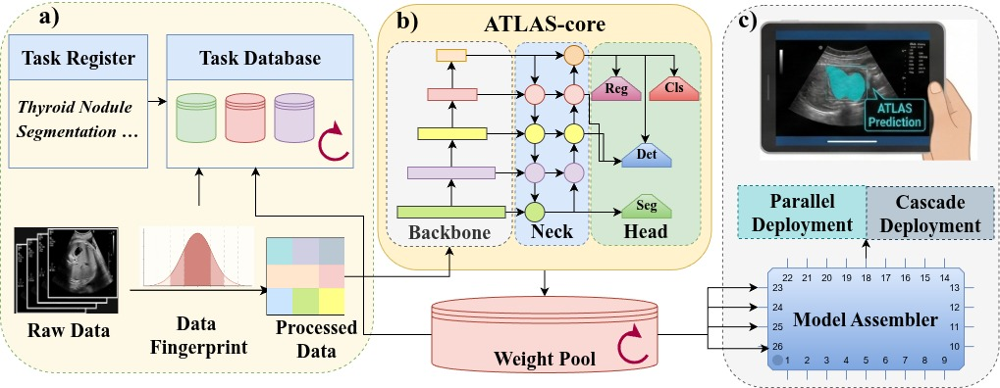

# ATLAS: A Lightweight Task-Decoupled Framework for Ultrasound Analysis

> This repository is provided in **anonymized form** for double-blind peer review .  
> All dataset paths, IDs, and examples are illustrative and do not reveal any author or institution identity.

ATLAS is a a task-decoupled framework that instantiates a standardized and ultra-lightweight template  (`ATLAScore`) into physically isolated expert branches, each featuring a single task-specific head for:

- **Classification**
- **Segmentation**
- **Regression** (keypoint / landmark localization)
- **Detection** (single-box)

It provides a full pipeline from dataset preparation and task registration to training, evaluation, inference, and clinical-style visualization.

---

---

## 1. Features

- **Unified task abstraction**
  - All tasks are managed via a central `tasks_db.json` and `TaskManager`.
  - Each task has `task_id`, `anatomy`, `task_name`, `num_classes`, `label_map`, dataset meta, and automatic data fingerprint.

- **Single backbone, multi-head design**
  - `modelzoom/ATLAScore.py` implements a CNN-only backbone (`Backbone`) + neck (`Neck`) + task heads:
    - `ClsHead` (classification)
    - `SegHead` (segmentation)
    - `RegHead` (regression)
    - `DetHead` (detection)

- **Model factory & multi-task orchestration**
  - `MultiTaskModelFactory` builds multiple task branches from configs.
  - `assembler.AtlasAssembler` loads a set of trained tasks and exposes a unified `.predict(...)` interface.

- **Task-aware data pipeline**
  - `preprocess.py` converts raw datasets into a unified CSV format.
  - `dataset.MultiTaskDataset` and `MultiTaskUniformSampler` provide consistent sampling and augmentation.
  - `utils.evaluate` computes per-task metrics (Accuracy, F1, Dice, 1/MAE, IoU).

- **End-to-end CLI workflow**
  - `register.py` for interactive task registration.
  - `preprocess.py` for dataset indexing.
  - `train.py` for single-task training (with optional warm start).
  - `test.py` for independent test evaluation.
  - `deploy.py` for inference (parallel / cascade) and automatic visualization (`visualizer.py`).

---

## 2. Repository Structure

```text
ATLAS/
  ├── assembler.py           # Multi-task inference engine (AtlasAssembler)
  ├── dataset.py             # MultiTaskDataset & MultiTaskUniformSampler
  ├── dataset_convert.py     # Convert existing CSV to ATLAS data structure
  ├── deploy.py              # CLI inference entry (parallel / cascade) + auto visualization
  ├── inspect_task.py        # CLI to inspect task details from tasks_db.json
  ├── merge_db.py            # Merge local/remote tasks_db with ID conflict resolution
  ├── model_factory.py       # MultiTaskModelFactory wrapping ATLAScore
  ├── modelzoom/
  │   └── ATLAScore.py       # Core backbone/neck/heads implementation
  ├── preprocess.py          # Build train CSVs from raw data folders
  ├── register.py            # Interactive task registration CLI
  ├── sample/
  │   ├── *.jpg / *.png      # Demo images
  ├── task_manager.py        # TaskManager & high-level task listing/inspection
  ├── tasks_db.json          # Central task registry (JSON database)
  ├── test.py                # Independent test evaluation script
  ├── train.py               # Training script for a single task_id
  ├── utils.py               # Collate, losses, metrics, evaluation, detection decode
  ├── visualizer.py          # AtlasVisualizer for drawing boxes/masks/points + side legend
  └── weights/
      ├── backbone.pth       # Shared backbone weights
      └── *.pth              # Per-task weights
```

---

## 3. Installation

### 3.1. Clone the Repository

```bash
git clone https://github.com/<ANON_USER>/ATLAS.git
cd ATLAS
```

### 3.2. Environment

Create a Python environment (conda or venv is recommended) and install dependencies.  
Typical dependencies (adjust versions as needed):

```bash
pip install torch torchvision torchaudio --index-url https://download.pytorch.org/whl/cu121  # or cpu version
pip install opencv-python albumentations pandas numpy tqdm scikit-learn matplotlib segmentation-models-pytorch
```

> Note: `segmentation_models_pytorch` is used for Dice loss in segmentation.

---

## 4. Data Format

ATLAS assumes a **per-task directory layout** under a root such as `./data/train` (for training) and `./data/test` (for independent testing).


### 4.1. Training Data Layout

For each `task_id`:

```text
data/train/
  └── {task_id}/
      ├── imagesTr/            # training images
      ├── labelsTr/            # segmentation/detection masks or VOC XML (optional)
      └── labels.csv           # classification/regression labels (optional)
```

#### 4.1.1. Classification

`labels.csv`:

```text
filename,label
img_001.jpg,0
img_002.jpg,1
...
```

- `task_name` should be `"classification"`.
- `num_classes` is the number of label IDs (0..num_classes-1).

#### 4.1.2. Regression (Keypoints)

`labels.csv`:

```text
filename,point_1_xy,point_2_xy
img_001.png,"[239, 188]","[401, 102]"
img_002.png,"[250, 170]","[390, 90]"
```

- `task_name` should be `"regression"`.
- `num_classes` is the number of points; each point field is `point_{i}_xy`.

#### 4.1.3. Segmentation

- Image folder: `imagesTr/`
- Mask folder: `labelsTr/` (masks with the same base filename, arbitrary suffix: `.png`, `.tif`, ...)
- Mask values: 0..num_classes-1,while 0 for background.

`preprocess.py` dynamically finds masks:

```text
labelsTr/
  ├── img_001.png
  ├── img_002.png
  └── ...
```

#### 4.1.4. Detection

- Image folder: `imagesTr/`
- Annotation folder: `labelsTr/` with Pascal VOC XML:

```text
labelsTr/
  ├── img_001.xml
  ├── img_002.xml
  └── ...
```

`preprocess.py` parses multiple objects into fields like `x_min_1`, `y_min_1`, `x_max_1`, `y_max_1`, etc.

---

## 5. Task Management

All task metadata is stored in `tasks_db.json` and managed via `TaskManager`.

### 5.1. Interactive Task Registration

Run:

```bash
python register.py
```

You will be asked to define:

- **Task ID**: unique ID, e.g. `thyroid_nodule_seg` (can be anonymized).
- **Description**: human-readable description.
- **Anatomy**: choose from a preset list (`Fetal`, `Breast`, `Thyroid`, `Liver`, `Heart`, `Lung`, `Abdomen`, `ovary`, `cervix`, `Other`).
- **Task Type**: `classification`, `segmentation`, `regression`, `detection`.
- **num_classes**: number of classes or keypoints.
- **label_map**: clinical meaning for each class index (0..num_classes‑1).
- **Dataset name** and **source type** .

`TaskManager.register_task(...)` writes a structured record into `tasks_db.json` and sets default `weight_path` to `weights/{task_id}.pth`.

### 5.2. List and Inspect Tasks

```bash
python inspect_task.py
```

- Prints a table summary of all tasks.
- Then allows querying a specific `task_id` to display full configuration, metrics, and data fingerprint.

---

## 6. Preprocessing (Train CSV Generation)

After placing raw data under `data/train/{task_id}`, run:

### 6.1. Single Task

```bash
python preprocess.py --task_id FUGC
```

### 6.2. All Tasks

```bash
python preprocess.py
```

`AtlasPreprocessor` will:

1. Load task config via `TaskManager`.
2. Scan `imagesTr/` and associated `labelsTr/` / `labels.csv`.
3. Build per-task CSVs under `./data/train/csv_files/{task_id}.csv`.
4. Update `tasks_db.json` with:
   - `resample_target`: median H×W.
   - `status`: `"ready"`.
   - `train_samples`: number of usable samples.

Errors (empty folders, missing masks, duplicated filenames, etc.) are reported with explicit messages.

---

## 7. Training

`train.py` trains a **single task** specified by `--task_id`.

### 7.1. Basic Training Command

```bash
python train.py --task_id FUGC
```

Internals:

- Reads config from `TaskManager`.
- Uses `MultiTaskDataset` and `MultiTaskUniformSampler` with Albumentations transforms.
- Splits into train/val/test using `VAL_SPLIT` and `TES_SPLIT`.
- Loss functions:
  - `segmentation`: DiceLoss (multiclass).
  - `classification`: CrossEntropyLoss.
  - `regression`: MSELoss.
  - `detection`: `ATLAS_SingleBoxLoss`.
- Optimizer: `AdamW` + cosine LR scheduler.
- Early stopping with patience.
- Logs to `logs/` and saves best checkpoint to `weights/{TASK_ID}.pth`.
- Calls `utils.evaluate` on test split and writes back metrics to `tasks_db.json`.

### 7.2. Warm Start / Transfer Learning
#### 7.2.1 Warm Start from single task

```bash
python train.py --task_id NEW_TASK_ID --resume_from SOURCE_TASK_ID
```

- Loads `weights/{SOURCE_TASK_ID}.pth` into `NEW_TASK_ID` branch (backbone shared; head can differ).
- Implemented via `MultiTaskModelFactory.load_task_weights(..., strict=False)`.

#### 7.2.2 Warm Start from MTL ATLSAS-core weights

```bash
python train.py --task_id NEW_TASK_ID --mtl_weights weights/share_backbone.pth
```

- Loads `MTL ATLAS-core weights` into `NEW_TASK_ID` branch (backbone shared; head can differ).
- The MTL weights are a mix of 1 backbone + 27 task heads with ATLAS-core trained in 27 tasks.
- Implemented via `MultiTaskModelFactory.load_shared_multitask_weights(..., strict=False)`.
- When triggered via --resume_from, the system automatically applies a $0.1\times$ learning rate multiplier to the backbone and neck, ensuring the inherited clinical knowledge is preserved while the new head converges rapidly.

---

## 8. Independent Testing

`test.py` evaluates a trained task on an **independent test set** that uses the same folder conventions as training but located, e.g., under `data/test/`.

### 8.1. Command

```bash
python test.py --task_id FUGC --data_root ./data/test
```

Pipeline:

1. `TestPreprocessor` builds a temporary DataFrame from `data/test/{task_id}`.
2. `TestDataset` + per-task Albumentations transforms (`Resize` + `Normalize` + `ToTensorV2`).
3. `MultiTaskModelFactory` instantiates only this task branch and loads `weights/{task_id}.pth`.
4. Runs `utils.evaluate` and prints metrics table.
5. Saves `test_results_metrics.csv` under `data/test/{task_id}/`.

---

## 9. Inference and Visualization

### 9.1. Multi-Task Assembler

`AtlasAssembler` (in `assembler.py`) wraps a set of trained task branches into a single inference engine:

```python
from assembler import AtlasAssembler

engine = AtlasAssembler(task_id_list=["task_a", "task_b"])
res = engine.predict(image_input, task_id="task_a")
```

Where `image_input` can be:

- A file path (string), or
- An OpenCV `np.ndarray` in BGR format.

The prediction dictionary contains:

- `task_id`, `type` and a `prediction` field with:
  - Classification: `class_id`, `label`, `confidence`, `probs`.
  - Segmentation: `mask_raw`, `mask_shape`, `lesion_area_ratio`.
  - Regression: list of pixel `keypoints`.
  - Detection: `box` (`[x1, y1, x2, y2]`) and `label`.

### 9.2. CLI Inference (Parallel / Cascade)

`deploy.py` is the main CLI inference script. Run:

```bash
python deploy.py
```

It will:

1. Print an ASCII ATLAS logo.
2. List tasks with `status == "completed"`.
3. Ask user to choose:
   - Mode: `[1] Parallel` or `[2] Cascade`.
   - Task indices to run.
4. Build `AtlasAssembler` with selected tasks.
5. Iterate over images in `sample/`.
6. Save predictions to `results/json/*.json` and segmentation masks to `results/masks/*.png`.
7. Automatically call `visualizer.AtlasVisualizer.draw_all()` to produce overlays in `results/vis/`.

#### 9.2.1 Mode [1] (Parallel Screening)
Allows users to input multiple task indices (e.g., 0,2). The system executes each task sequentially on the full image using a unified template.

#### 9.2.2 Mode [2] (Cascaded Reasoning)
Requires the first index to be a Detection task. The framework then automatically performs Region of Interest (ROI) cropping and feeds the results into subsequent analysis sub-tasks (segmentation or classification).

### 9.3. Visualization

`visualizer.py` draws:

- Detection boxes.
- Segmentation masks (per-class colors).
- Regression keypoints and simple measurements.

For each image, it also creates a right-side legend (task and class labels with colors).

Outputs:

```text
results/vis/vis_{image_name}
```

---

## 10. Utilities

### 10.1. Reproduce FMC_UIA Dataset ATLAS training

`dataset_convert.py` converts FMC_UIA Dataset into ATLAS-style per-task folders:

- Reads FMC_UIA Dataset original CSVs (e.g. `../data/train/csv_files/*.csv`).
- Creates `output/{task_id}/imagesTr` and `output/{task_id}/labelsTr`.
- Deduplicates filenames and rewrites `labels.csv` for classification/regression tasks.

### 10.2. Task Database Merge For Git Conflicts

`merge_db.py` merges:

- `tasks_db.json` (local), and
- `tasks_db_remote.json` (remote backup, e.g. from git conflict),

while:

- Keeping local `task_id`s unchanged.
- Renaming conflicting remote IDs to `ID_1`, `ID_2`, ...
- Renaming matching `weights/*.pth` and `data/train/csv_files/*.csv`.
- Updating `weight_path` and appending a note in `description`.

This is useful when multiple anonymous contributors work on different tasks in parallel.

### 10.3. Task Inspection

```bash
python inspect_task.py
```

Used to:

- Summarize all tasks.
- Interactively inspect a single `task_id` with full config and statistics.

---

## 11. Typical Workflow (For Reviewers)

This section summarizes how the framework is intended to be used; reviewers can follow it with their own anonymized data if desired.

1. **Register a new task (anonymized ID)**

   ```bash
   python register.py
   ```

2. **Prepare data directories under `data/train/{task_id}`**

3. **Preprocess to build CSV & data fingerprint**

   ```bash
   python preprocess.py --task_id {task_id}
   ```

4. **Train the task**

   ```bash
   python train.py --task_id {task_id}
   # or with warm start
   python train.py --task_id {task_id} --resume_from backbone_or_other_task_id
   ```

5. **Independent test (optional)**

   ```bash
   python test.py --task_id {task_id} --data_root ./data/test
   ```

6. **Run inference + auto visualization**

   ```bash
   python deploy.py
   # then inspect:
   #   results/json/*.json
   #   results/masks/*.png
   #   results/vis/*.png
   ```

---

## 12. Notes on Anonymization

- No author names, institution names, or dataset site names are hard-coded in the codebase.
- Task IDs and dataset names in `tasks_db.json` are from FMC_UIA public dataset.

---

## 13. License

To preserve anonymity, the concrete license and affiliation details are intentionally omitted for the review phase.  
They will be added after the review process is complete.

